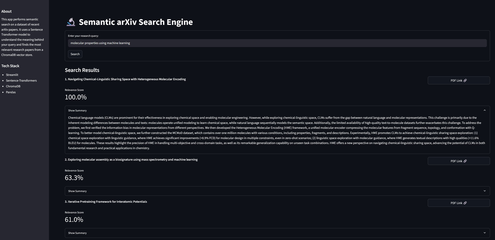

# Semantic Search Engine for arXiv Papers



## 📖 Overview
This project is an end-to-end semantic search engine that allows users to search for computer science research papers from the arXiv database based on meaning, not just keywords. It uses sentence embeddings to understand the context of both the user's query and the paper abstracts.

## ✨ Features
- **Semantic Search**: Understands natural language queries.
- **Interactive UI**: Built with Streamlit for a clean, user-friendly interface.
- **Efficient Backend**: Uses ChromaDB for near-instantaneous similarity search.

## 🛠️ Tech Stack
- **ML/AI**: PyTorch, Sentence-Transformers
- **Vector Database**: ChromaDB
- **Web Framework**: Streamlit
- **Versioning**: Git, DVC

## 🚀 Getting Started
    
1.  **Clone the repository:**
    ```bash
    git clone [https://github.com/SakshamVats/semantic-arxiv-search.git](https://github.com/SakshamVats/semantic-arxiv-search.git)
    cd semantic-arxiv-search
    ```
2.  **Install dependencies and pull data:**
    ```bash
    pip install -r requirements.txt
    dvc pull
    ```
3.  **Run the application:**
    ```bash
    streamlit run app.py
    ```